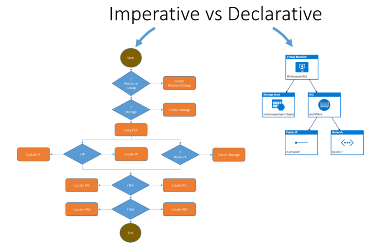
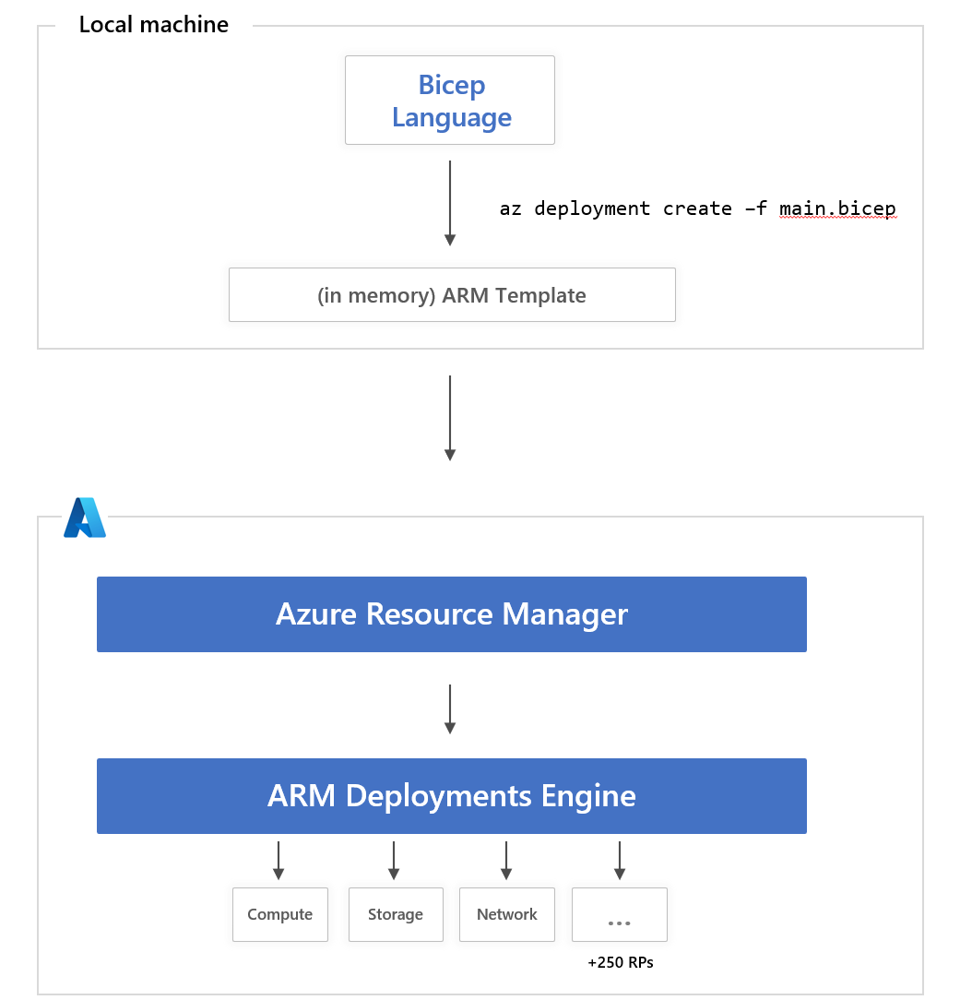

# Building in the Cloud with Bicep

# Chris Ayers 

---

## Chris Ayers
### Senior Customer Engineer Microsoft

<i class="fa-brands fa-twitter"></i> Twitter: @Chris\_L\_Ayers
<i class="fa-brands fa-mastodon"></i> Mastodon: @Chrisayers@hachyderm.io
<i class="fa-brands fa-linkedin"></i> LinkedIn: - [chris\-l\-ayers](https://linkedin.com/in/chris-l-ayers/)
<i class="fa fa-window-maximize"></i> Blog: [https://chris-ayers\.com/](https://chris-ayers.com/)
<i class="fa-brands fa-github"></i> GitHub: [Codebytes](https://github.com/codebytes)

---

# Agenda
- What is IaC?
- What is Bicep?
- What is Azure Resource Manager? 
- Demos
---

# What is IaC?
Infrastructure as Code (IaC) is the managing and provisioning of infrastructure through code instead of through manual processes.

---

# IaC Styles

## Imperative

- Do what I want
- Do X in the system
- List of commands
- Manage your own dependencies
- Polling to handling timing

## Declarative

- What I want
- Make the system look like X
- List of resources / configuration
- System knows the dependencies
- System knows how to handle timings

---

---

# Popular IaC Technologies

## Native

- ARM / Bicep
- AWS Cloud Formation
- Google Cloud Deployment Manager

## Non Native

- Terraform
- Pulumi
- Vagrant
- Chef
- Puppet
- Ansible
- SaltStack 
  

---

# ARM / Bicep / Terraform

Feature | ARM | Bicep | Terraform
---|---|---|---
Format | Json | DSL | DSL - HCL (HashiCorp Language) 
Target | Azure | Azure | Multi-Cloud or On-Prem through providers
Support | Native
Day-0 | Native
Day-0 | Support can lag with AzureRM
 Day-0 with AzApi 
State | Azure | Azure | State File via files, Blob, or Terraform Cloud

---

# Bicep Features

### <i class="fa fa-code"></i> Simpler Syntax. No JSON noise
### <i class="fa fa-object-group"></i> Declarative Syntax
### <i class="fa fa-th-large"></i> Modularity
### <i class="fa fa-cogs"></i> Built for tool-ability
### <i class="fa fa-exchange"></i> Convert existing templates

___

# Bicep and ARM

---

# ARM Templates
## Json & Bicep

---

# Azure Resource Manager (ARM)

---

# Azure Resource IDs

---

# Parameter Design

---

# File Layout

---

# Demos

---

# Questions

---

# Resources 

## Links

- [https://docs.microsoft.com/en-us/events/learntv/learnlive-iac-and-bicep/](https://docs.microsoft.com/en-us/events/learntv/learnlive-iac-and-bicep/)
- [https://github.com/codebytes](https://github.com/codebytes)

## Chris Ayers 

<i class="fa-brands fa-twitter"></i> Twitter: @Chris\_L\_Ayers
<i class="fa-brands fa-mastodon"></i> Mastodon: @Chrisayers@hachyderm.io
<i class="fa-brands fa-linkedin"></i> LinkedIn: - [chris\-l\-ayers](https://linkedin.com/in/chris-l-ayers/)
<i class="fa fa-window-maximize"></i> Blog: [https://chris-ayers\.com/](https://chris-ayers.com/)
<i class="fa-brands fa-github"></i> GitHub: [Codebytes](https://github.com/codebytes)

